# 一、Spring

### 1.1、简介

* Spring：春天——>给软件行业带来了春天！
* 2002，首次推出了Spring框架的雏形：interface21
* Spring框架即以interface21框架为基础，经过重新设计，并不断丰富其内涵，于2004年3月24日，发布了1.0正式版
* **Rod Johnson**，Spring Framework创始人，著名作者。很难想象Rod Johnson的学历，真的让好多人大吃一惊，他是悉尼大学的博士，然而他的专业不是计算机，而是音乐学
* **Spring理念：**使现有的技术更加容易使用，本身是一个大杂烩，整合了现有的技术框架
* SSH：Struts2 + Spring + Hibernate
* SSM：SpringMvc + Spring + MyBatis


官网：https://spring.io/projects/spring-framework

官方下载地址：https://repo.spring.io/release/org/springframework/spring/

GitHub：https://github.com/spring-projects/spring-framework


```xml
<!-- https://mvnrepository.com/artifact/org.springframework/spring-webmvc -->
<dependency>
     <groupId>org.springframework</groupId>
     <artifactId>spring-webmvc</artifactId>
     <version>5.3.3</version>
</dependency>
<!-- https://mvnrepository.com/artifact/org.springframework/spring-jdbc -->
<dependency>
     <groupId>org.springframework</groupId>
     <artifactId>spring-jdbc</artifactId>
     <version>5.3.3</version>
</dependency>
```


### 1.2、优点

* Spring是一个开源的免费的框架（容器）！
* Spring是一个轻量级的、非入侵式的框架！
* **控制反转（IOC），面向切面编程（AOP）**
* 支持事务的处理，对框架整合的支持！


**总结：Spring就是一个轻量级的控制反转（IOC）和面向切面编程（AOP）的框架！**


### 1.3、组成

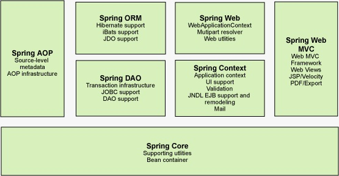

```xml
1:spring core：提供了spring 的核心功能，BeanFactory是spring核心容器的主要组件，

它通过Ioc把程序的配置和依赖性与实际的代码分开，是整个spring的基础

2:spring context：通过配置文件向spring提供上下文信息，它构建在BeanFactory之上，

另外增加了国际化和资源访问等功能

3:spring dao：提供了一个简单有效的JDBC应用

4:spring aop：提供了面向方面编程的功能

5:spring orm：spring除了有自己的JDBC以外还提供了对其他ORM框架的支持，如

Hibernate，都可以和spring进行良好的结合

6:spring web：提供了简化的处理多部分请求以及把请求参数绑定到域的任务。

7:spring MVC：提供了MVC2模式的实现，也可以和struts良好的集成在一起。
```


### 1.4、拓展

在Spring的官网中有这个介绍：现代化的Java开发！就是基于Spring的开发

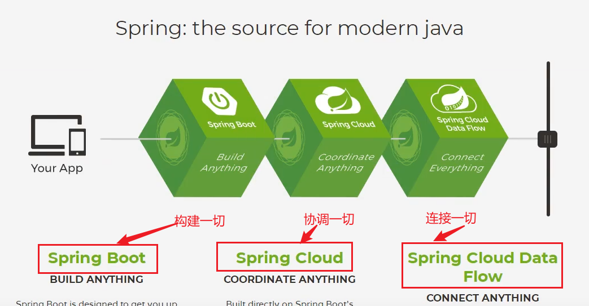

* Spring Boot
  * 一个快速开发的脚手架
  * 基于Spring Boot可以快速开发单个微服务
  * 约定大于配置！
* Spring Cloud
  * SpringCloud是基于SpringBoot实现的


因为现在大多数公司都在使用SpringBoot进行快速开发，学习SpringBoot的前期，需要完全掌握Spring和SpringMVC！承上启下的作用！


**弊端：发展了太久之后，违背了原来的理念！配置十分繁琐，人称："配置地狱！"**


# 二、 IOC理论推导

1. UserDao 接口

   

2. UserDaoIml  实现类

   

3. UserService 业务接口

   

4. UserService 业务实现类


在我们之前的业务中，用户的需求可能会影响我们源代码，我们需要根据用户的需求去修改源代码！如果程序代码量十分大，修改一次的成本代价十分昂贵！

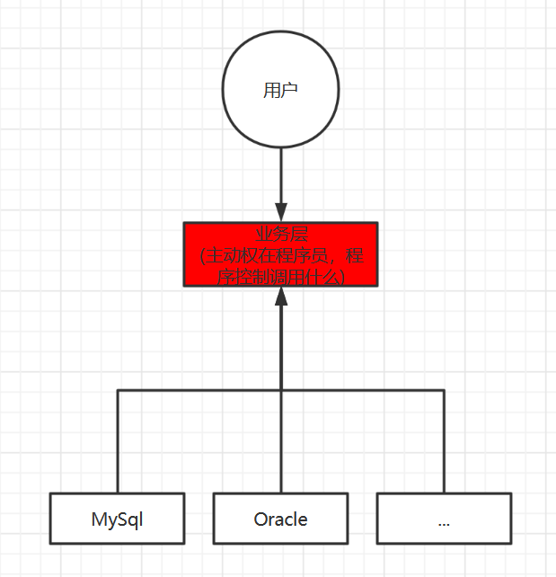

我们使用一个Set接口实现，已经发生了革命性的变化

```java
private UserDao userDao;

//利用setting方法进行动态实现值的注入！
public void setUserDao(UserDao userDao) {
     this.userDao = userDao;
}
```

* 之前，程序是主动创建对象！控制权在程序员手上
* 使用了set注入后，程序不再具有主动性，而是变成了被动接受的对象


这种思想，从本质上解决了问题，我们程序员不用再去管理对象的创建了，系统的耦合性大大降低了，可以更加专注的在业务的实现上！这是IOC的原型！

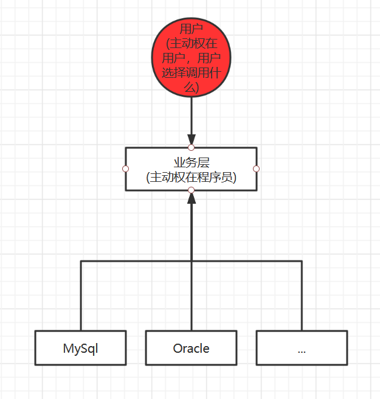


### IOC本质

**控制反转IoC(Inversion of Control)，是一种设计思想，DI(依赖注入)是实现IoC的一种方法**，也有人认为DI只是IoC的另一种说法。没有IoC的程序中，我们使用面向对象编程，对象的创建与对象间的依赖关系完全硬编码在程序中，对象的创建由程序自己控制，控制反转后将对象的创建转移给第三方，个人认为所谓的控制反转就是：获得依赖对象的方法反转了

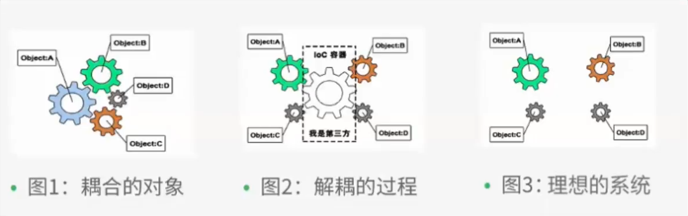

**控制反转是一种通过描述（XML或注解）并通过第三方去生产或获取特定对象的方式。在Spring中实现控制反转的是IoC容器，其实现方法是依赖注入（Dependency Injection，DI）**


# 三、HelloSpring

```java
public static void main(String[] args) {
     //获取ApplicationContext：拿到Spring的容器
     ApplicationContext context = new ClassPathXmlApplicationContext("beans.xml");
     //容器在手，天下我有，需要什么，就直接get什么
     UserService userService = (UserService) context.getBean("userService");
     userService.getUser();
```

### 思考问题？

* Hello对象是谁创建的？

  Hello对象是由Spring创建的

* Hello对象的属性是怎么设置的？

  Hello对象的属性是由Spring容器设置的

这个过程就是控制反转：

**控制**：谁来控制对象，传统应用程序的对象是由程序本身控制创建的，使用Spring后，对象是由Spring来创建

**反转**：程序本身不创建对象，而变成被动的接收对象

依赖注入：就是利用Setting方法来进行注入的

IoC是一种编程的思想，有主动的编程变成被动的接收

可以通过new ClassPathXmlApplicationContext去浏览一下底层原码

**到了现在，我们彻底不用在程序中去改动了，要实现不同的操作，只需要在XML配置文件中进行修改，所谓的IoC，一句话搞定：对象由Spring来创建、管理、装配！**


# 四、IoC创建对象的方式

1. 使用无参构造创建对象，默认！

2. 假设我们要使用有参构造创建对象。

   1. 下标赋值

      ```xml
      <!--第一种：下标赋值-->
      <bean class="com.guighost.pojo.User" id="user">
           <constructor-arg index="0" value="鬼鬼"/>
      </bean>
      ```

   2. 类型

      ```xml
      <!--
              不建议使用：
              第二种：通过类型创建
      -->
      <bean class="com.guighost.pojo.User" id="user">
           <constructor-arg type="java.lang.String" value="guigui"/>
      </bean>
      ```

   3. 参数名

      ```xml
      <!--
              第三种：通过参数名设置
      -->
      <bean class="com.guighost.pojo.User" id="user">
           <constructor-arg name="name" value="鬼鬼"/>
      </bean>
      ```


总结：在配置文件(ApplicationContext.xml)加载的时候，Spring容器中管理的对象就已经初始化了（\<bean>标签中的对象被new出来了）！


# 五、Spring的配置

### 5.1、别名

```xml
<!--
        别名：如果设置了别名，我们也可以通过别名获取到该对象（getBean("user或userNew")）
    -->
<alias name="user" alias="userNew"/>
```

### 5.2、Bean的配置

 ```xml
<!--
        id：bean的唯一标识符，也就是相当于我们所学的对象名
        class：bean对象所对应的全限定类名：包名+类名
        name：也是别名，而且name可以同时取多个别名
        (别名之间可以用,(逗号)，;(分号)或者空格隔开)
-->
<bean id="userT" class="com.guighost.pojo.UserT" name="user2,u2 u3;u4">
     <property name="name" value="u2"/>
</bean>
 ```

### 5.3、Import

Import一般用于团队开发使用，可以将多个配置文件，导入合并为一个

假设，现在项目中有多个人开发，这个三个负责不同类的开发，不同的类需要注册在不同的bean中，我们可以利用Import将所有人的beans.xml合并为一个总的！

* 张三

* 李四

* 王五

* applicationContext.xml 

  ```xml
  <?xml version="1.0" encoding="UTF-8"?>
  <beans xmlns="http://www.springframework.org/schema/beans"
         xmlns:xsi="http://www.w3.org/2001/XMLSchema-instance"
         xsi:schemaLocation="http://www.springframework.org/schema/beans
                             https://www.springframework.org/schema/beans/spring-beans.xsd">
  
       <import resource="beans.xml"/>
  </beans>
  ```

使用的时候，直接使用总的配置就可以了


# 六、依赖注入（DI：Dependency Injection）

### 6.1、构造器注入

同上

### 6.2、Set方式注入【重点】

* 依赖注入：Set注入
  * 依赖：bean对象的创建依赖于容器
  * 注入：bean对象中的所有属性，由容器来注入


【环境搭建】

1. 复杂类型

   ```java
   /**
    * @author GuiGhost
    * @date 2021/02/20
    * 说明：地址类
    */
   public class Address {
        private String address;
   
        public String getAddress() {
             return address;
        }
   
        public void setAddress(String address) {
             this.address = address;
        }
   
        @Override
        public String toString() {
             return "Address{" +
                  "address='" + address + '\'' +
                  '}';
        }
   }
   ```

2. 真实测试对象

   ```java
   /**
    * @author GuiGhost
    * @date 2021/02/20
    * 说明：学生实体类
    */
   public class Student {
        private String name;
        private Address address;
        private String[] book;
        private List<String> hobbies;
        private Map<String,String> card;
        private Set<String> games;
        private String wife;
        private Properties info;
   }
   ```

3. applicatonContext.xml

   ```xml
   <?xml version="1.0" encoding="UTF-8"?>
   <beans xmlns="http://www.springframework.org/schema/beans"
          xmlns:xsi="http://www.w3.org/2001/XMLSchema-instance"
          xsi:schemaLocation="http://www.springframework.org/schema/beans
                              https://www.springframework.org/schema/beans/spring-beans.xsd">
   
        <bean id="student" class="com.guighost.pojo.Student">
             <!--第一种：普通值注入——>value属性-->
             <property name="name" value="鬼鬼"/>
        </bean>
   </beans>
   ```

4. 测试类

   ```java
   import com.guighost.pojo.Student;
   import org.springframework.context.ApplicationContext;
   import org.springframework.context.support.ClassPathXmlApplicationContext;
   
   /**
    * @author GuiGhost
    * @date 2021/02/20
    * 说明：
    */
   public class MyTest {
        public static void main(String[] args) {
             ApplicationContext context = new ClassPathXmlApplicationContext("applicationContext.xml");
             Student student = (Student) context.getBean("student");
             System.out.println(student.getName());
        }
   }
   ```

5. 完善注入信息

   ```xml
   <?xml version="1.0" encoding="UTF-8"?>
   <beans xmlns="http://www.springframework.org/schema/beans"
          xmlns:xsi="http://www.w3.org/2001/XMLSchema-instance"
          xsi:schemaLocation="http://www.springframework.org/schema/beans
                              https://www.springframework.org/schema/beans/spring-beans.xsd">
   
        <bean id="address" class="com.guighost.pojo.Address">
             <property name="address" value="地球"/>
        </bean>
   
        <bean id="student" class="com.guighost.pojo.Student">
             <!--第一种：普通值注入——>value属性-->
             <property name="name" value="鬼鬼"/>
             <!--第二种：bean注入——>ref属性-->
             <property name="address" ref="address"/>
             <!--第三种：数组注入——> array-value标签-->
             <property name="book">
                  <array>
                       <value>红楼梦</value>
                       <value>西游戏</value>
                       <value>水浒传</value>
                       <value>三国演义</value>
                  </array>
             </property>
             <!--list注入——> list-value标签-->
             <property name="hobbies">
                  <list>
                       <value>听歌</value>
                       <value>运动</value>
                       <value>打豆豆</value>
                  </list>
             </property>
   
             <!--map注入——> map-entry标签-->
             <property name="card">
                  <map>
                       <entry key="身份证" value="450637200008086688"/>
                       <entry key="银行卡" value="6888866666888668068"/>
                  </map>
             </property>
             <!--set注入——> set-value标签-->
             <property name="games">
                  <set>
                       <value>LOL</value>
                       <value>CS:GO</value>
                  </set>
             </property>
             <!--null注入——> null标签-->
             <property name="wife">
                  <null/>
             </property>
             <!--properties注入——> props-prop标签-->
             <property name="info">
                  <props>
                       <prop key="driver">2018007</prop>
                       <prop key="url"></prop>
                       <prop key="username">root</prop>
                       <prop key="password">ghost</prop>
                  </props>
             </property>
        </bean>
   </beans>
   ```

### 6.3、拓展方式注入

我们可以使用p命名空间和c命名空间进行注入

**官方解释：**


**使用：**

```xml
<?xml version="1.0" encoding="UTF-8"?>
<beans xmlns="http://www.springframework.org/schema/beans"
       xmlns:xsi="http://www.w3.org/2001/XMLSchema-instance"
       xmlns:p="http://www.springframework.org/schema/p"
       xmlns:c="http://www.springframework.org/schema/c"
       xsi:schemaLocation="http://www.springframework.org/schema/beans
                           https://www.springframework.org/schema/beans/spring-beans.xsd">

     <!--p命名空间注入，可以直接注入属性的值（相当于property标签）-->
     <bean id="user" class="com.guighost.pojo.User" p:name="老鬼" p:age="20"/>

     <!--c命名空间注入，通过构造器注入：construct-args-->
     <bean id="user2" class="com.guighost.pojo.User" c:age="18" c:name="鬼鬼"/>
</beans>
```

**测试：**

```java
@Test
public void pNameSpaceTest(){
     ApplicationContext context = new ClassPathXmlApplicationContext("user.xml");
     User user = context.getBean("user2", User.class);
     System.out.println(user);
}
```

**注意点：**

* p命名和c命名空间不能直接使用，需要导入xml约束

  ```xml
  xmlns:p="http://www.springframework.org/schema/p"
  xmlns:c="http://www.springframework.org/schema/c"
  ```


### 6.4、bean的作用域

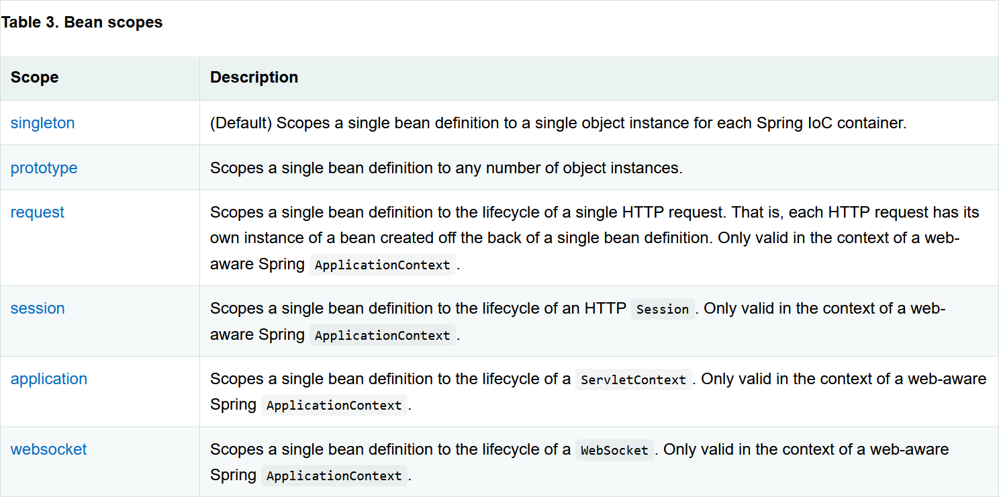

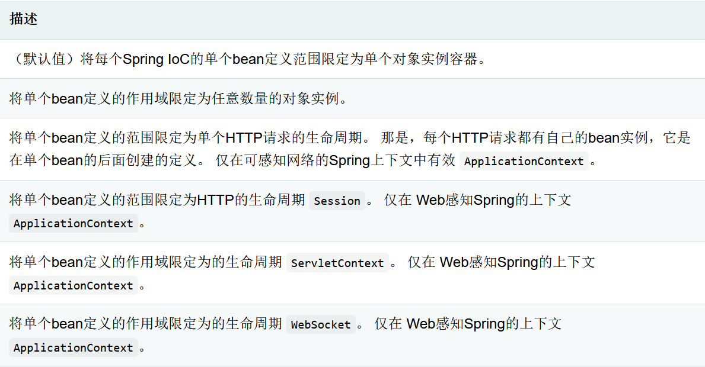

1. 单例模式（Spring默认机制）

   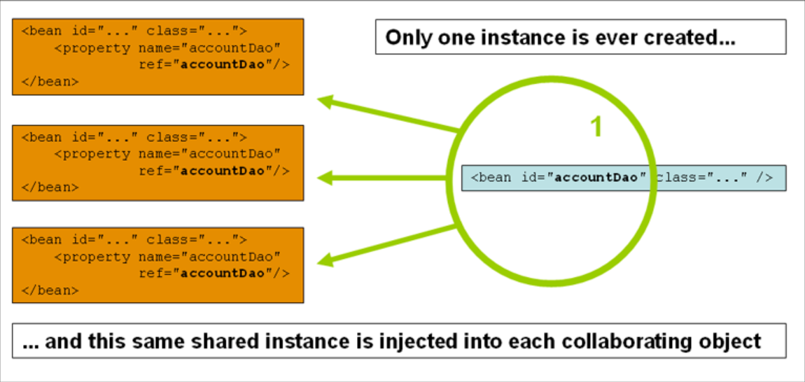

   ```xml
   <bean id="user2" class="com.guighost.pojo.User" c:age="18" c:name="鬼鬼" scope="singleton"/>
   <!--scope="singleton"表示为该对象以单例模式创建（默认）-->
   ```

2. 原型模式：每次从容器中get的时候，都会产生一个新的对象

   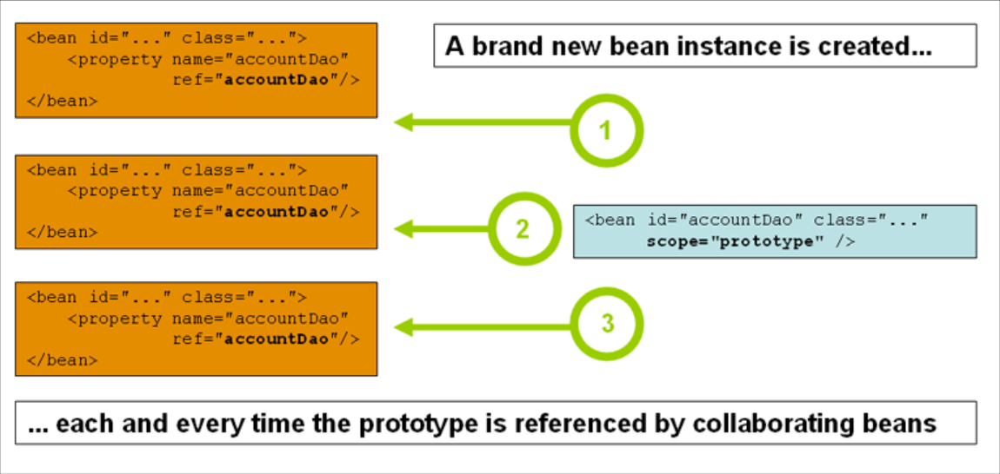

   ```xml
   <bean id="accountService" class="com.something.DefaultAccountService" scope="prototype"/>
   ```

3. 其余的request、session、application这些个只能在web开发中使用到！


# 七、Bean的自动装配

* 自动装配是Spring满足bean依赖的一种方式
* Spring会在上下文中自动寻找，并自动给bean装配属性


在Spring中有三种装配的方式

1. 在xml中的显示的配置
2. 在Java中显示配置
3. 隐式的自动装配【重要】


### 7.1、测试

环境搭建：一个人两个宠物（三个对象（实体类））

### 7.2、ByName自动装配

```xml
<bean id="cat" class="com.guighost.pojo.Cat"/>
<bean id="dog" class="com.guighost.pojo.Dog"/>

<!--
        ByName：会自动在容器上下文中查找，和对象set方法后面的值对应的bean的id
    -->
<bean id="people" class="com.guighost.pojo.People" autowire="byName">
     <property name="name" value="GuiGhost"/>
</bean>
```

### 7.3、ByType自动装配

```xml
<bean id="cat" class="com.guighost.pojo.Cat"/>
<bean id="dog" class="com.guighost.pojo.Dog"/>

<!--
        ByName：会自动在容器上下文中查找，和对象set方法后面的值对应的bean的id
        ByType：会自动在容器上下文中查找，和对象中属性类型一样的bean（前提是容器的上下文中该类型是唯一的）
    -->
<bean id="people" class="com.guighost.pojo.People" autowire="byName">
     <property name="name" value="GuiGhost"/>
</bean>
```

小结：

* ByName：需要保证所有bean的id唯一，并且这个bean需要和自动注入的属性的set方法set后面的值一致
* ByType：需要保证所有bean的class唯一，并且这个bean需要和自动注入的属性的类型一致

### 7.4、使用注解实现自动装配

jdk1.5支持的注解，Spring2.5就支持注解了！

The introduction of annotation-based configuration raised the question of whether this approach is “better” than XML

要使用注解须知：

1. 导入约束：context约束

   ```xml
   xmlns:context="http://www.springframework.org/schema/context"
   ```

2. **配置注解的支持：\<context:annotation-config/>**【重要】

   ```xml
   <?xml version="1.0" encoding="UTF-8"?>
   <beans xmlns="http://www.springframework.org/schema/beans"
       xmlns:xsi="http://www.w3.org/2001/XMLSchema-instance"
       xmlns:context="http://www.springframework.org/schema/context"
       xsi:schemaLocation="http://www.springframework.org/schema/beans
           https://www.springframework.org/schema/beans/spring-beans.xsd
           http://www.springframework.org/schema/context
           https://www.springframework.org/schema/context/spring-context.xsd">
   
       <context:annotation-config/>
   
   </beans>
   ```


**@Autowired**

直接在属性上使用即可，也可以在set方法上进行使用

使用**@Autowired**我们可以不用编写Set方法，但前提是该自动装配的属性在IoC容器中存在且符合名字ByName

科普：

```xml
@Nullable 字段标记了这个注解，说明这个字段可以为null
```

```java
public @interface Autowired {
     boolean required() default true;
}
```

测试代码

```java
package com.guighost.pojo;

import org.springframework.beans.factory.annotation.Autowired;

/**
 * @author GuiGhost
 * @date 2021/02/21
 * 说明：
 */
public class People {
     //如果显示定义了Autowired的required属性为false，说明这个对象可以为null，否则不允许为空
     @Autowired(required = false)
     private Cat cat;
     @Autowired
     private Dog dog;
     private String name;


     public Cat getCat() {
          return cat;
     }

     public void setCat(Cat cat) {
          this.cat = cat;
     }

     public Dog getDog() {
          return dog;
     }

     public void setDog(Dog dog) {
          this.dog = dog;
     }

     public String getName() {
          return name;
     }

     public void setName(String name) {
          this.name = name;
     }

     @Override
     public String toString() {
          return "People{" +
               "cat=" + cat +
               ", dog=" + dog +
               ", name='" + name + '\'' +
               '}';
     }
}

```

如果@Autowired自动装配的环境比较复杂，自动装配无法通过一个注解【@Autowired】完成的时候，我们可以使用@Qualifier(value = "XX")去配合@Autowired的使用，指定一个唯一的bean对象注入

```java
public class People {
     //如果显示定义了Autowired的required属性为false，说明这个对象可以为null，否则不允许为空
     @Autowired(required = false)
     private Cat cat;
     @Autowired
     @Qualifier(value = "dog2")
     private Dog dog;
     private String name;
}
```

**@Resource注解**

```java
public class People {
     @Resource(name = "cat2")
     private Cat cat;
     @Resource
     private Dog dog;
     private String name;
}
```

小结：

@Autowired和@Resource的区别

* 都是用来自动装配的，都可以直接放在属性字段上
* @Autowired通过ByType的方式实现，而且必须要求这个对象存在！【常用】
* @Resource默认通过ByName的方式实现，若找不到对应的名字，则通过ByType实现！若通过这两种方式都找不到，就会报错！【常用】
* 执行顺序不同：@Autowired通过ByType的方式实现，@Resource默认通过ByName的方式实现


# 八、使用注解开发

在Spring4之后，要使用注解开发，必须要保证aop的包导入了

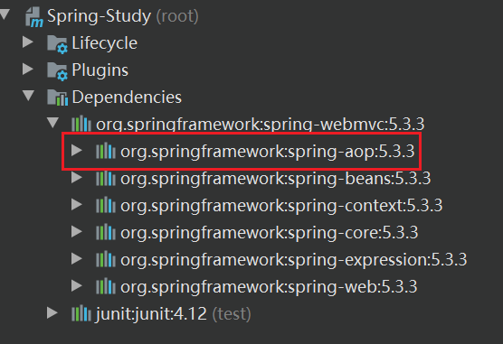

使用注解需要导入context的约束，增加注解的支持

```xml
<?xml version="1.0" encoding="UTF-8"?>
<beans xmlns="http://www.springframework.org/schema/beans"
       xmlns:xsi="http://www.w3.org/2001/XMLSchema-instance"
       xmlns:context="http://www.springframework.org/schema/context"
       xsi:schemaLocation="http://www.springframework.org/schema/beans
                           https://www.springframework.org/schema/beans/spring-beans.xsd
                           http://www.springframework.org/schema/context
                           https://www.springframework.org/schema/context/spring-context.xsd">

     <context:annotation-config/>

</beans>
```


1. bean

2. 属性如何注入

   ```java
   package com.guighost.pojo;
   
   import org.springframework.beans.factory.annotation.Value;
   import org.springframework.stereotype.Component;
   
   /**
    * @author GuiGhost
    * @date 2021/02/21
    * 说明：
    */
   //等价于<bean id="user" class="com.guighost.pojo.User"/>
   //@Component组件
   @Component
   public class User {
   
        private String name;
   
        public String getName() {
             return name;
        }
   
        //相当于<property name="name" value="guighost"/>
        @Value("guighost")
        public void setName(String name) {
             this.name = name;
        }
   }
   
   ```

3. 衍生的注解

   @Component有几个衍生注解，我们在web开发中，会按照mvc三层架构分层！

   - dao层【@Repository】
   - service层【@Service】
   - controller层【@Controller】

   这四个注解功能都是一样的，都是代表将某个类注册到Spring容器中，装配Bean

4. 自动装配

   ```
   @Autowired：自动装配通过类型，名字
   	如果Autowired不能唯一自动装配上属性，则需要通过@Qualifier(value="xxx")
   @Nullable：字段标记了这个注解，说明这个字段可以为null
   @Resource：自动装配，通过名字，类型
   ```

5. 作用域

   ```java
   package com.guighost.pojo;
   
   import org.springframework.beans.factory.annotation.Value;
   import org.springframework.context.annotation.Scope;
   import org.springframework.stereotype.Component;
   
   /**
    * @author GuiGhost
    * @date 2021/02/21
    * 说明：
    */
   //等价于<bean id="user" class="com.guighost.pojo.User"/>
   //@Component组件
   @Component
   @Scope("singleton")//单例模式
   public class User {
   
        private String name;
   
        public String getName() {
             return name;
        }
   
        //相当于<property name="name" value="guighost"/>
        @Value("guighost")
        public void setName(String name) {
             this.name = name;
        }
   }
   ```

6. 小结

   xml与注解：

   - xml更加万能，适用于任何场合！维护简单方便
   - 注解 不是自己类使用不了维护相对复杂

   xml与注解最佳实践：

   - xml用来管理bean；

   - 注解只负责完成属性的注入

   - 我们在使用的过程中，只需要注意一个问题：必须让注解生效，就需要开启注解的支持

     ```xml
     <!--指定要扫描的包，这个包下的注解就会生效-->
     <context:component-scan base-package="com.guighost"/>
     <context:annotation-config/>
     ```


# 九、使用Java的方式配置Spring

我们现在要完全不使用Spring的xml配置了，全权交给Java来做！

JavaConfig是Spring的一个子项目，在Spring4之后，它成为了一个核心功能！

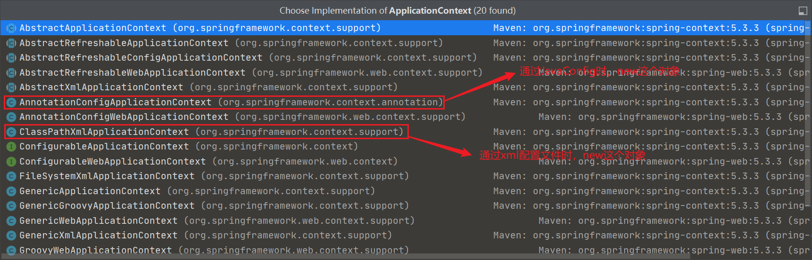

**实体类：**

```java 
package com.guighost.pojo;

import org.springframework.beans.factory.annotation.Value;
import org.springframework.stereotype.Component;

/**
 * @author GuiGhost
 * @date 2021/02/21
 * 说明：
 */
//该注解的意思，就是说明这个类被Spring容器接管了，注册到了容器中
@Component
public class User {
     private String name;

     public String getName() {
          return name;
     }
     @Value("ghost")//属性注入值
     public void setName(String name) {
          this.name = name;
     }

     @Override
     public String toString() {
          return "User{" +
               "name='" + name + '\'' +
               '}';
     }
}
```
**配置类（相当于applicationContext.xml配置文件）：**

```java
package com.guighost.config;

import com.guighost.pojo.User;
import org.springframework.context.annotation.Bean;
import org.springframework.context.annotation.ComponentScan;
import org.springframework.context.annotation.Configuration;
import org.springframework.context.annotation.Import;

/**
 * @author GuiGhost
 * @date 2021/02/21
 * 说明：
 */
@Configuration
@ComponentScan("com.guighost.pojo")
@Import(GhostConfig2.class)
/**
 * 这个也会被Spring容器托管，注册到容器中，因为他本来就是一个@Component
 * @Configuration 代表这是一个配置类，就相当于之前的beans.xml
 * */
public class GhostConfig {
     /**
     * 注册一个bean，就相当于我们写了一个bean标签
     * 这个方法的名字，就相当于bean标签中的id属性
     * 而这个方法的返回值，就相当于bean标签中的class属性
     * */
     @Bean
     public User getUser(){
          return new User();//就是返回要注入到bean的对象
     }
}
```
**测试类：**

```java
import com.guighost.config.GhostConfig;
import com.guighost.pojo.User;
import org.junit.Test;
import org.springframework.context.ApplicationContext;
import org.springframework.context.annotation.AnnotationConfigApplicationContext;

/**
 * @author GuiGhost
 * @date 2021/02/21
 * 说明：
 */
public class MyTest {
     @Test
     public void test(){
          /**
         * 如果完全使用了配置类方式去做，我们就只能通过ApplicationConfig上下文来获取容器，通过配置类的class对象加载
         * */
          ApplicationContext context = new AnnotationConfigApplicationContext(GhostConfig.class);
          User getUser = context.getBean("getUser", User.class);
          System.out.println(getUser.getName());
     }
}
```

这种纯Java的配置方式，在SpringBoot中随处可见


# 十、代理模式

为什么要学习代理模式？

因为这就是Spring AOP的底层！【SpringAOP 和 SpringMVC】

代理模式的分类：

* 静态代理
* 动态代理

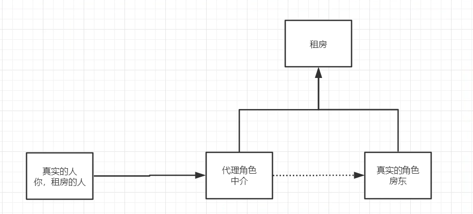

### 10.1、静态代理

角色分析：

* 抽象角色：一般会使用接口或者抽象类来解决
* 真实角色：被代理的角色
* 代理角色：代理真实角色，代理真实角色后，我们一般会做一些附属操作
* 客户：访问代理对象的人！ 


代码步骤：

1. 接口（租房业务）

   ```java
   package com.guighost.demo01;
   
   /**
    * @author GuiGhost
    * @date 2021/02/22
    * 说明：抽象角色：租房
    */
   public interface Rent{
        public void rent();
   }
   ```

2. 真实角色（房东）

   ```java
   package com.guighost.demo01;
   
   /**
    * @author GuiGhost
    * @date 2021/02/22
    * 说明：真实角色：房东
    */
   public class Host implements Rent{
        @Override
        public void rent() {
             System.out.println("房东要出租房子");
        }
   }
   ```

3. 代理角色（中介）

   ```java
   package com.guighost.demo01;
   
   /**
    * @author GuiGhost
    * @date 2021/02/22
    * 说明：代理角色
    */
   public class Proxy implements Rent{
        private Host host;
   
        public Proxy() {
        }
   
        public Proxy(Host host) {
             this.host = host;
        }
   
        @Override
        public void rent() {
             seeHouse();
             host.rent();
             hetong();
             fare();
        }
   
        //看房
        public void seeHouse(){
             System.out.println("中介带你看房");
        }
   
        //签租赁合同
        public void hetong(){
             System.out.println("签租赁合同");
        }
   
        //收中介费
        public void fare(){
             System.out.println("收中介费");
        }
   }
   ```

4. 客户端访问代理角色（租客通过中介租房）

   ```java
   package com.guighost.demo01;
   
   /**
    * @author GuiGhost
    * @date 2021/02/22
    * 说明：租客租房（通过中介）
    */
   public class Client {
        public static void main(String[] args) {
             //房东要出租房子
             Host host = new Host();
             /**
            * 代理：中介帮忙寻找租客
            * 但是，代理角色一般有附属操作
            * */
             Proxy proxy = new Proxy(host);
             //你不用面对房东，直接找中介租房即可
             proxy.rent();
        }
   }
   ```


代理模式的好处：

* 可以使真实角色的操作更加纯粹，不用去关注一些公共的业务
* 公共业务也就交给代理角色！实现了业务员的分工
* 公共业务发生扩展的时候，方便集中管理

缺点：

* 一个真实角色就会产生一个代理角色！代码量会翻倍，开发效率会变低


### 10.2、加深理解

代码： [点击此链接](G:\WorkSpace\Idea\Spring-Study\spring-08-proxy\src\main\java\com\guighost\demo02)

初探AOP

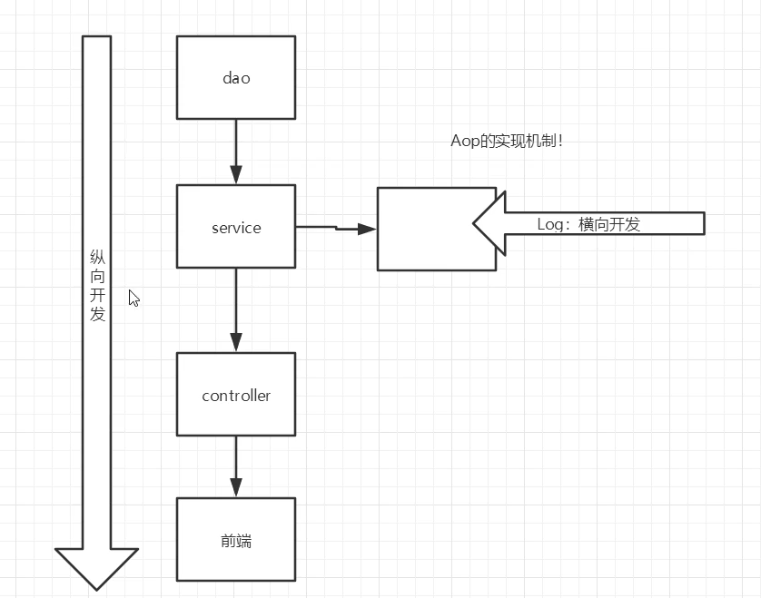


### 10.3、动态代理

* 动态代理和静态代理角色一样
* 动态代理的代理类是动态生成的，不是我们直接写好的
* 动态代理分为两大类：基于接口的动态代理基于类的动态代理
  * 基于接口——>JDK动态代理【我们这里使用】
  * 基于类——>cglib
  * Java字节码实现——>javassist


需要了解两个类：

* Proxy：代理

  * 使用Proxy类的静态方法```Proxy.newProxyInstance()```来生成代理类

    ```java
    //生成得到代理类
    public static Object newProxyInstance(ClassLoader loader,
                                              Class<?>[] interfaces,
                                              InvocationHandler h)
    ```

  * 参数：

    * loader: 用哪个类加载器去加载代理对象（实现了InvocationHandler接口的类的类加载器）

      ```java
      Proxy.newProxyInstance(this.getClass().getClassLoader(),//loader
                             target.getClass().getInterfaces(),
                             this);
      ```

    * interfaces:动态代理类需要实现的接口（被代理对象（真实对象）的接口）

      ```java
      Proxy.newProxyInstance(this.getClass().getClassLoader(),
                             target.getClass().getInterfaces(),//interfaces
                             this);
      ```

    * h:动态代理方法在执行时，会调用h里面的invoke方法去执行

* InvocationHandler：调用处理程序

  * 被代理的接口(真实对象)

    ```java
    //被代理的接口(真实对象)
    private Object target;
    
    public void setTarget(Object target) {
         this.target = target;
    }
    ```

  * 生成得到代理类

    ```java
    //生成得到代理类
    public Object getProxy(){
         return Proxy.newProxyInstance(this.getClass().getClassLoader(),
                                       target.getClass().getInterfaces(),this);
    }
    ```

  * 处理代理实例，并返回结果

    ```java
    //处理代理实例，并返回结果
    @Override
    public Object invoke(Object proxy, Method method, Object[] args) throws Throwable {
         seeHouse();//附属操作
         //动态代理的本质，就是使用反射机制
         Object result = method.invoke(rent, args);
         fare();//附属操作
         return result;
    }
    ```

  **代码展示：**

  ```java
  package com.guighost.demo03;
  
  import java.lang.reflect.InvocationHandler;
  import java.lang.reflect.Method;
  import java.lang.reflect.Proxy;
  
  /**
   * @author GuiGhost
   * @date 2021/02/23
   * 说明：
   */
  //等会我们会用这个类，自动生成代理类
  public class ProxyInvocationHandler implements InvocationHandler {
  
       //被代理的接口
       private Rent rent;
  
       public void setRent(Rent rent) {
            this.rent = rent;
       }
  
       //生成得到代理类
       public Object getProxy(){
            return Proxy.newProxyInstance(this.getClass().getClassLoader(),
                                          rent.getClass().getInterfaces(),this);
       }
  
       //处理代理实例，并返回结果
       @Override
       public Object invoke(Object proxy, Method method, Object[] args) throws Throwable {
            seeHouse();//附属操作
            //动态代理的本质，就是使用反射机制
            Object result = method.invoke(rent, args);
            fare();//附属操作
            return result;
       }
  
       public void seeHouse(){
            System.out.println("中介带看房子");
       }
  
       public void fare(){
            System.out.println("收中介费");
       }
  }
  ```

  


动态代理的好处：

* 可以使真实角色的操作更加纯粹，不用去关注一些公共的业务
* 公共业务也就交给代理角色！实现了业务员的分工
* 公共业务发生扩展的时候，方便集中管理
* 一个动态代理类代理的是一个接口，一般对应的就是一个业务
* 一个动态代理类可以代理多个类，只要实现了同一个接口即可


**代码参考：**[one](G:\WorkSpace\Idea\Spring-Study\spring-08-proxy\src\main\java\com\guighost\demo03)、[two](G:\WorkSpace\Idea\Spring-Study\spring-08-proxy\src\main\java\com\guighost\demo04)


# 十一、AOP（面向切面编程）

### 11.1、什么是AOP

**AOP（Aspect Oriented Programming）意为：面向切面编程。**通过预编译方式和运行期间动态代理实现**程序功能的统一维护**的一种技术。AOP是OOP的延续，是软件开发中的一个热点，也是Spring框架中的一个重要内容，是函数式编程的一种衍生范型。利用AOP可以对业务逻辑的各个部分进行隔离，从而使得业务逻辑各部分之间的耦合度降低，提高程序的可重用型，同时提高了开发的效率。

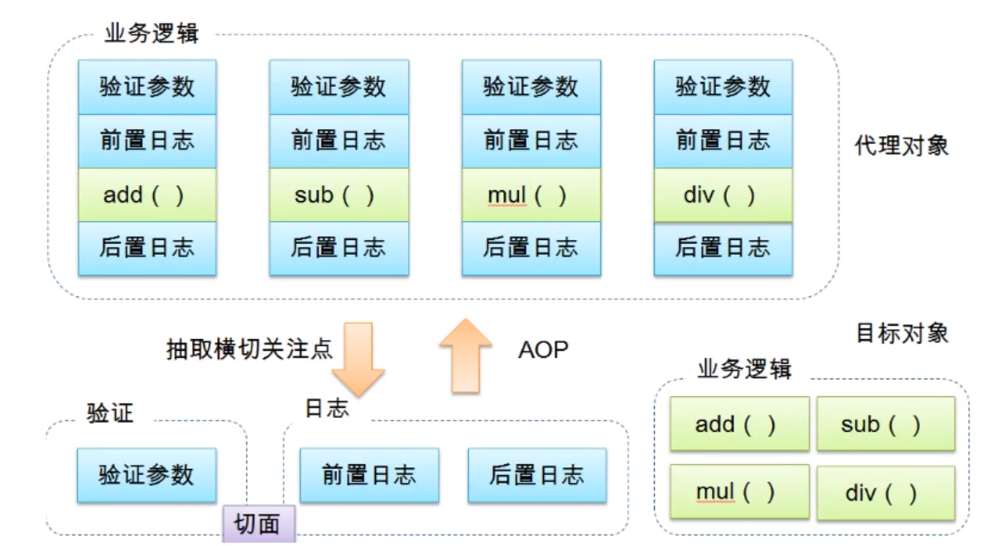


### 11.2、AOP在Spring中的作用

提供声明式事务；允许用户自定义切面

* 横切关注点：跨越应用程序多个模块的方法或功能。即是，与我们业务逻辑无关的，但是我们需要关注的部分，就是横切关注点。如日志、安全、缓存、事务等等……
* 切面（Aspect）：横切关注点被模块化的特殊对象。即，它是一个类。
* 通知（Advice）：切面必须要完成的工作。即，类中的一个方法
* 目标（Target）：被通知的对象
* 代理（Proxy）：向目标对象应用通知后创建的对象
* 切入点（PointCut）：切面通知执行的“地点”的定义。
* 连接点（JointPoint）:与切入点匹配的执行点

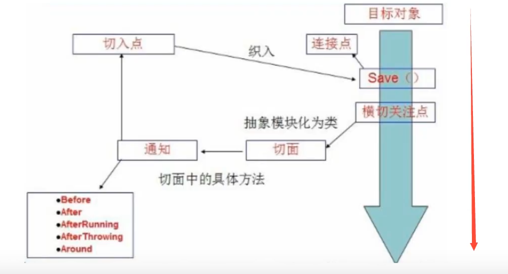

SpringAOP中，通过Advice定义横切逻辑，Spring中支持5中类型的Advice：

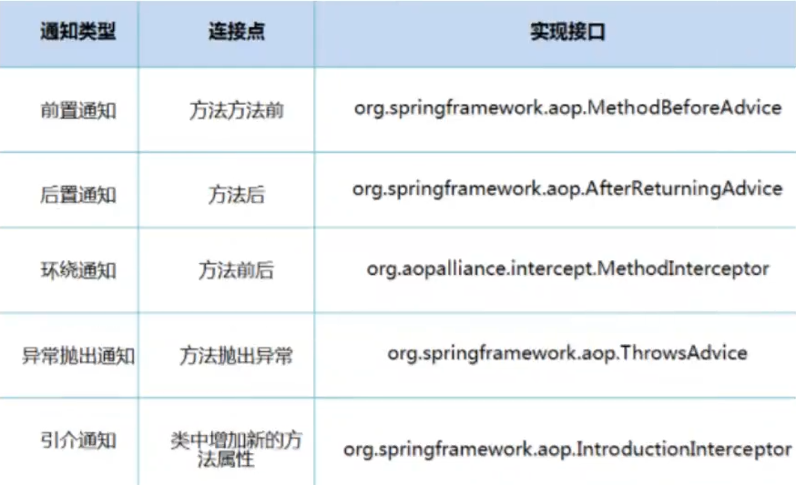

即AOP在不改变原有代码的情况下，去增加新的功能


### 11.3、使用Spring实现AOP

【重点】使用AOP织入，需要导入一个依赖包！

```xml
<!-- https://mvnrepository.com/artifact/org.aspectj/aspectjweaver -->
<dependency>
     <groupId>org.aspectj</groupId>
     <artifactId>aspectjweaver</artifactId>
     <version>1.9.6</version>
</dependency>
```

**execution表达式：执行（\* com.sample.service.impl .. \*.\*（..））****

| **符号**                    | **含义**                                                 |
| --------------------------- | -------------------------------------------------------- |
| **执行（）**                | **表达式的主体;**                                        |
| **第一个” \*“符号**         | **表示返回值的类型任意;**                                |
| **com.sample.service.impl** | **AOP所切的服务的包名，即，我们的业务部分**              |
| **包名后面的” ..“**         | **表示当前包及子包**                                     |
| **第二个” \*“**             | **表示类名，\*即所有类。此处可以自定义，下文有举例**     |
| **.\*（..）**               | **表示任何方法名，括号表示参数，两个点表示任何参数类型** |

方式一：使用Spring的API接口【只要是SpringAPI接口实现】

**API接口：**

```java
package com.guighost.log;

import org.springframework.aop.AfterReturningAdvice;
import java.lang.reflect.Method;

/**
 * @author GuiGhost
 * @date 2021/02/23
 * 说明：使用Spring API接口实现：后置增强
 */
public class AfterLog implements AfterReturningAdvice {
     /**
     * returnValue：返回值
     * */
     @Override
     public void afterReturning(Object returnValue, Method method, Object[] args, Object target) throws Throwable {
          System.out.println("执行了" + method.getName() + "方法，返回结果为" + returnValue);
     }
}
```

```java
package com.guighost.log;

import org.springframework.aop.MethodBeforeAdvice;
import java.lang.reflect.Method;

/**
 * @author GuiGhost
 * @date 2021/02/23
 * 说明：使用Spring API接口实现：前置增强
 */
public class Log implements MethodBeforeAdvice {
     /**
     * method：要执行的目标对象的方法
     * objects：参数
     * target：目标对象
     * */
     @Override
     public void before(Method method, Object[] args, Object target) throws Throwable {
          System.out.println(target.getClass().getSimpleName() + "类的" + method.getName() + "方法被执行了");
     }
}
```

**配置文件：**

```xml
<!--方式一：使用原生Spring API接口-->
<!--配置AOP：需要导入AOP的约束-->
<aop:config>
     <!--切入点：expression表达式：配置执行的位置-->
     <aop:pointcut id="pointCut" expression="execution(* com.guighost.service.UserServiceImpl.*(..))"/>
     <!--执行环绕增强-->
     <aop:advisor advice-ref="log" pointcut-ref="pointCut"/>
     <aop:advisor advice-ref="afterLog" pointcut-ref="pointCut"/>
</aop:config>
```

**测试：**

```java
import com.guighost.service.UserService;
import org.springframework.context.ApplicationContext;
import org.springframework.context.support.ClassPathXmlApplicationContext;

/**
 * @author GuiGhost
 * @date 2021/02/23
 * 说明：Spring AOP接口测试
 */
public class MyTest {
     public static void main(String[] args) {
          ApplicationContext context = new ClassPathXmlApplicationContext("applicationContext.xml");
          //动态代理代理的是接口
          UserService userService = context.getBean("userService", UserService.class);
          userService.add();
     }
}
```

方式二：自定义来实现AOP【主要是切面定义】

**自定义切面：**

```java
package com.guighost.diy;

/**
 * @author GuiGhost
 * @date 2021/02/23
 * 说明：自定义切面
 */
public class DiyPointCut {
     public void before(){
          System.out.println("========方法执行前========");
     }

     public void after(){
          System.out.println("========方法执行后========");
     }
}
```

**配置文件：**

```xml
<!--方式二：自定义类-->
<bean class="com.guighost.diy.DiyPointCut" id="diyPointCut"/>
<aop:config>
     <!--aop:aspect：自定义切面，ref要引用的类-->
     <aop:aspect ref="diyPointCut">
          <!--切入点-->
          <aop:pointcut id="point" expression="execution(* com.guighost.service.UserServiceImpl.*(..))"/>
          <!--通知-->
          <aop:before method="before" pointcut-ref="point"/>
          <aop:after method="after" pointcut-ref="point"/>
     </aop:aspect>
</aop:config>
```

**测试：**

```java
import com.guighost.service.UserService;
import org.springframework.context.ApplicationContext;
import org.springframework.context.support.ClassPathXmlApplicationContext;

/**
 * @author GuiGhost
 * @date 2021/02/23
 * 说明：Spring AOP接口测试
 */
public class MyTest {
     public static void main(String[] args) {
          ApplicationContext context = new ClassPathXmlApplicationContext("applicationContext.xml");
          //动态代理代理的是接口
          UserService userService = context.getBean("userService", UserService.class);
          userService.add();
     }
}
```

方式三：使用注解实现！

**注解：**

* @Aspect：标注该类为一个切面
* @Before("execution(* com.guighost.service.UserServiceImpl.*(..))")：前置增强
* @After("execution(* com.guighost.service.UserServiceImpl.*(..))")：后置增强
* @Around("execution(* com.guighost.service.UserServiceImpl.*(..))")：环绕增强

```java
package com.guighost.diy;

import org.aspectj.lang.ProceedingJoinPoint;
import org.aspectj.lang.Signature;
import org.aspectj.lang.annotation.After;
import org.aspectj.lang.annotation.Around;
import org.aspectj.lang.annotation.Aspect;
import org.aspectj.lang.annotation.Before;

/**
 * @author GuiGhost
 * @date 2021/02/23
 * 说明：使用注解方式实现aop
 */
@Aspect//标注该类为一个切面
public class AnnotationPointCut {
     //前置增强
     @Before("execution(* com.guighost.service.UserServiceImpl.*(..))")
     public void before(){
          System.out.println("========before========");
     }

     //后置增强
     @After("execution(* com.guighost.service.UserServiceImpl.*(..))")
     public void after(){
          System.out.println("========after========");
     }

     //环绕增强
     /**
     * 在环绕增强中，我们可以给定一个参数，代表我们要获取处理切入的点
     * */
     @Around("execution(* com.guighost.service.UserServiceImpl.*(..))")
     public void around(ProceedingJoinPoint joinPoint) throws Throwable {
          //环绕前
          System.out.println("========Around Before========");
          Signature signature = joinPoint.getSignature();//获得签名(被切入的方法名)
          System.out.println("signature签名：" + signature.getName());
          //执行方法
          Object proceed = joinPoint.proceed();
          //环绕后
          System.out.println("========Around After========");
          System.out.println("proceed：" + proceed);
     }

}
```


**配置文件：**

**测试：**

```java
import com.guighost.service.UserService;
import org.springframework.context.ApplicationContext;
import org.springframework.context.support.ClassPathXmlApplicationContext;

/**
 * @author GuiGhost
 * @date 2021/02/23
 * 说明：Spring AOP接口测试
 */
public class MyTest {
     public static void main(String[] args) {
          ApplicationContext context = new ClassPathXmlApplicationContext("applicationContext.xml");
          //动态代理代理的是接口
          UserService userService = context.getBean("userService", UserService.class);
          userService.add();
     }
}
```


# 十二、整合MyBatis

步骤：

1. 导入相关jar包
  - Junit
  - MyBatis
  - MySQL数据库
  - Spring相关的
  - AOP织入
  - mybatis-spring【new 新包 】
2. 编写配置文件
3. 测试


### 12.1、回忆MyBatis

1. 编写实体类
2. 编写核心配置文件
3. 编写接口
4. 编写Mapper.xml
5. 测试


### 12.2、MyBatis-Spring

1. 编写数据源配置

   ```xml
   <!--DataSource：使用Spring的数据源替换MyBatis的配置 (c3p0 dbcp druid)
           我们这里使用Spring提供的JDBC：org.springframework.jdbc.datasource
       -->
   <bean class="org.springframework.jdbc.datasource.DriverManagerDataSource" id="dataSource">
        <property name="driverClassName" value="com.mysql.cj.jdbc.Driver"/>
        <property name="url" value="jdbc:mysql://localhost:3306/mybatis?useSSL=true&amp;useUnicode=true&amp;characterEncoding=UTF-8&amp;serverTimezone=UTC"/>
        <property name="username" value="root"/>
        <property name="password" value="ghost"/>
   </bean>
   ```

2. sqlSessionFactory配置

   ```xml
   <!--sqlSessionFactory-->
   <bean class="org.mybatis.spring.SqlSessionFactoryBean" id="sqlSessionFactory">
        <property name="dataSource" ref="dataSource"/>
        <!--绑定MyBatis配置文件-->
        <property name="configLocation" value="classpath:mybatis-config.xml"/>
        <property name="mapperLocations" value="classpath:com/guighost/mapper/*.xml"/>
   </bean>
   ```

3. sqlSessionTemplate配置

   ```xml
   <!--SqlSessionTemplate：就是我们使用的SqlSession对象-->
   <bean class="org.mybatis.spring.SqlSessionTemplate" id="sqlSession">
        <!--只能使用构造器注入sqlSessionFactory，因为他没有Setting方法-->
        <constructor-arg index="0" ref="sqlSessionFactory"/>
   </bean>
   ```

4. 需要给接口加实现类【】

   ```java
   package com.guighost.mapper;
   
   import com.guighost.pojo.User;
   import org.mybatis.spring.SqlSessionTemplate;
   
   import java.util.List;
   
   /**
    * @author GuiGhost
    * @date 2021/02/24
    * 说明：在该类中注入SqlSessionTemplate，并实现我们写的业务接口
    */
   public class UserMapperImpl implements UserMapper{
   
        //原来，我们的所有操作，都是用sqlSession来执行；现在都使用SqlSessionTemplate
        public SqlSessionTemplate sqlSession;
   
        public void setSqlSession(SqlSessionTemplate sqlSession) {
             this.sqlSession = sqlSession;
        }
   
        @Override
        public List<User> selectUser() {
             return sqlSession.getMapper(UserMapper.class).selectUser();
        }
   }
   ```

5. 将自己写的实现类，注入到Spring容器中

   ```xml
   <!--将实现类注入IoC容器，并为该类注入sqlSessionTemplate属性-->
   <bean class="com.guighost.mapper.UserMapperImpl" id="userMapper">
        <property name="sqlSessionTemplate" ref="sqlSessionTemplate"/>
   </bean>
   ```

6. 测试使用 

   ```java
   import com.guighost.mapper.UserMapper;
   import com.guighost.pojo.User;
   
   import org.junit.Test;
   import org.springframework.context.ApplicationContext;
   import org.springframework.context.support.ClassPathXmlApplicationContext;
   import java.io.IOException;
   import java.util.List;
   
   /**
    * @author GuiGhost
    * @date 2021/02/23
    * 说明：测试类
    */
   public class MyTest {
        @Test
        public void test01() throws IOException {
             ApplicationContext context = new ClassPathXmlApplicationContext("applicationContext.xml");
             UserMapper userMapper = context.getBean("userMapper2", UserMapper.class);
             List<User> userList = userMapper.selectUser();
             for (User user : userList) {
                  System.out.println(user);
             }
        }
   }
   ```

7. 附加：将配置了Mybatis-Spring的xml文件引入spring的核心配置文件（主要是配置MyBatis的）

   ```xml
   <?xml version="1.0" encoding="utf8"?>
   <beans xmlns="http://www.springframework.org/schema/beans"
          xmlns:xsi="http://www.w3.org/2001/XMLSchema-instance"
          xmlns:aop="http://www.springframework.org/schema/aop"
          xsi:schemaLocation="http://www.springframework.org/schema/beans
                              https://www.springframework.org/schema/beans/spring-beans.xsd
                              http://www.springframework.org/schema/aop
                              https://www.springframework.org/schema/aop/spring-aop.xsd">
   
        <!--引入Mybatis-Spring的配置文件-->
        <import resource="spring-dao.xml"/>
   
   
        <!--将实现类注入IoC容器，并为该类注入sqlSessionTemplate属性-->
        <bean class="com.guighost.mapper.UserMapperImpl" id="userMapper">
             <property name="sqlSessionTemplate" ref="sqlSessionTemplate"/>
        </bean>
   
        <bean class="com.guighost.mapper.UserMapperImpl2" id="userMapper2">
             <property name="sqlSessionFactory" ref="sqlSessionFactory"/>
        </bean>
   </beans>
   ```

   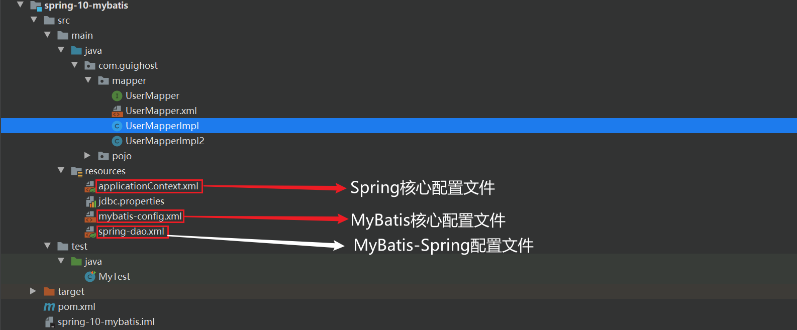


# 十三、声明式事务

### 13.1、回顾事务

* 将一组业务当成一个整体来做；要么都成功，否则都失败
* 事务在项目开发中，十分重要，涉及到数据的一致性问题，不能马虎
* 确保完整性和一致性


事务ACID原则：

* **原子性（atomicity）：**一个事务要么全部成功提交，要么全部失败回滚，不能只执行其中的一部分操作

* **一致性（consistency）：**事务的执行不能破坏数据库数据的完整性和一致性，一个事务在执行之前和执行之后，数据库都必须处于一致性状态

  如果数据库系统在运行过程中发生故障，有些事务尚未完成就被迫中断，这些未完成的事务对数据库所作的修改有一部分已写入物理数据库，这是数据库就处于一种不正确的状态，也就是不一致的状态

* **隔离性（isolation）：**多个业务可能操作同一个资源，防止数据损坏

  事务的隔离性是指在并发环境中，并发的事务时相互隔离的，一个事务的执行不能不被其他事务干扰。不同的事务并发操作相同的数据时，每个事务都有各自完成的数据空间，即一个事务内部的操作及使用的数据对其他并发事务时隔离的，并发执行的各个事务之间不能相互干扰

  在标准SQL规范中，定义了4个事务隔离级别：

  1. **读未提交（Read Uncommited）**，该隔离级别允许脏读取，其隔离级别最低；比如事务A和事务B同时进行，事务A在整个执行阶段，会将某数据的值从1开始一直加到10，然后进行事务提交，此时，事务B能够看到这个数据项在事务A操作过程中的所有中间值（如1变成2，2变成3等），而对这一系列的中间值的读取就是未授权读取
  2. 授权读取也称为**已提交读（Read Commited）**，授权读取只允许获取已经提交的数据。比如事务A和事务B同时进行，事务A进行+1操作，此时，事务B无法看到这个数据项在事务A操作过程中的所有中间值，只能看到最终的10。另外，如果说有一个事务C，和事务A进行非常类似的操作，只是事务C是将数据项从10加到20，此时事务B也同样可以读取到20，即授权读取允许不可重复读取。
  3. **可重复读（Repeatable Read)**:就是保证在事务处理过程中，多次读取同一个数据时，其值都和事务开始时刻是一致的，因此该事务级别禁止不可重复读取和脏读取，但是有可能出现幻影数据。所谓幻影数据，就是指同样的事务操作，在前后两个时间段内执行对同一个数据项的读取，可能出现不一致的结果。在上面的例子中，可重复读取隔离级别能够保证事务B在第一次事务操作过程中，始终对数据项读取到1，但是在下一次事务操作中，即使事务B（注意，事务名字虽然相同，但是指的是另一个事务操作）采用同样的查询方式，就可能读取到10 20；
  4. **串行化**：是最严格的事务隔离级别，它要求所有事务被串行执行，即事务只能一个接一个的进行处理，不能并发执行。

* **持久性（durability）**

  一旦事务提交，那么它对数据库中的对应数据的状态的变更就会永久保存到数据库中。--即使发生系统崩溃或机器宕机等故障，只要数据库能够重新启动，那么一定能够将其恢复到事务成功结束的状态


### 13.2、spring中的事务管理

* 声明式事务：利用AOP横切

  ```xml
  <!--配置声明式事务-->
  <bean class="org.springframework.jdbc.datasource.DataSourceTransactionManager" id="transactionManager">
       <property name="dataSource" ref="dataSource"/>
  </bean>
  
  <!--结合AOP实现事务的织入-->
  <!--配置事务通知（advice）：-->
  <tx:advice id="txAdvice" transaction-manager="transactionManager">
       <!--给哪些方法配置事务-->
       <!--配置事务的传播特性-->
       <tx:attributes>
            <tx:method name="add" propagation="REQUIRED"/>
            <tx:method name="delete" propagation="REQUIRED"/>
            <tx:method name="update" propagation="REQUIRED"/>
            <tx:method name="query" read-only="true"/>
            <tx:method name="*" propagation="REQUIRED"/>
       </tx:attributes>
  </tx:advice>
  
  <!--配置事务切入-->
  <aop:config>
       <aop:pointcut id="txPointCut" expression="execution(* com.guighost.mapper.*.*(..))"/>
       <aop:advisor advice-ref="txAdvice" pointcut-ref="txPointCut"/>
  </aop:config>
  ```

* 编程式事务：需要在代码中，进行事务的管理


思考：

为什么需要事务？

* 如果不配置事务，可能存在数据提交不一致的情况
* 如果我们不在Spring中配置声明式事务，我们就需要在代码中手动配置事务
* 事务在项目开发中非常重要，涉及到数据的一致性和完整性

